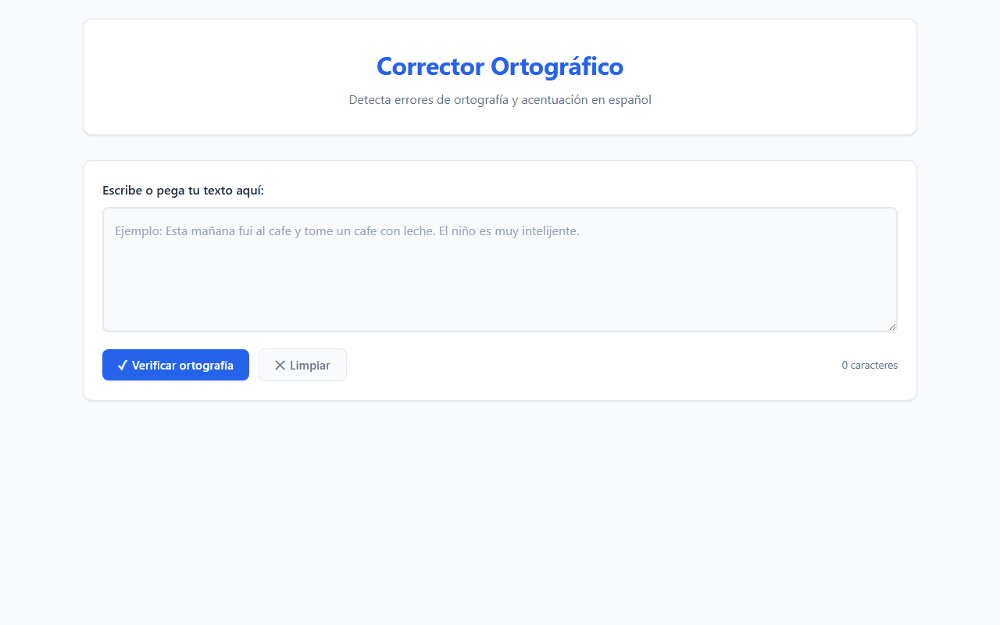

# Corrector Ortográfico en Español

Aplicación web de una sola página para practicar escritura en español, con detección automática de errores ortográficos y de acentuación. No requiere instalación ni servidor: funciona directamente en el navegador abriendo `index.html`.

---

## Capturas de pantalla

### Estado inicial



### Resultado tras verificar ortografía


---

## Características

- Detección de errores ortográficos y de acentuación en español
- Subrayado rojo ondulado sobre cada palabra con error
- Popup de sugerencias al hacer clic en un error
- Aplicación de correcciones con un clic (y re-verificación automática)
- Opción de ignorar errores individualmente
- Panel de resumen con errores agrupados por categoría
- Indicador de carga durante la consulta a la API
- Contador de caracteres con alerta de límite
- Diseño responsivo para escritorio y móvil
- Sin instalación, sin servidor, sin registro

---

## Tecnologías

| Componente | Tecnología |
|------------|------------|
| Estructura | HTML5 |
| Estilos | CSS3 (variables, grid, animaciones) |
| Lógica | JavaScript ES2020 (vanilla, sin frameworks) |
| API | [LanguageTool Public API](https://languagetool.org/http-api/) |

---

## Estructura del proyecto

```
DeteccionOrtografia/
├── index.html        # Estructura HTML de la aplicación
├── style.css         # Estilos y diseño visual
├── app.js            # Lógica de la aplicación
├── images/
│   ├── screenshot-inicial.png    # Captura del estado inicial
│   └── screenshot-resultado.png  # Captura con errores detectados
└── README.md         # Este archivo
```

---

## Cómo usar

1. Abre el archivo `index.html` en tu navegador (Chrome, Firefox o Edge)
2. Escribe o pega texto en español en el área de texto
3. Haz clic en **"Verificar ortografía"**
4. Espera unos segundos mientras se consulta la API
5. Los errores aparecen subrayados en rojo en el panel "Texto revisado"
6. Haz clic en cualquier palabra subrayada para ver sugerencias
7. Haz clic en una sugerencia para aplicar la corrección automáticamente
8. O haz clic en "Ignorar error" para descartar ese error

### Ejemplos de texto para probar

```
Esta mañana fui al cafe y tome un cafe con leche.
El niño es muy intelijente y le gusta la matematica.
Hoy me siento muy contento y quiero salir a caminar.
```

---

## API de LanguageTool

La aplicación usa la **API pública gratuita** de LanguageTool.

### Endpoint

```
POST https://api.languagetool.org/v2/check
Content-Type: application/x-www-form-urlencoded

text=<texto>&language=es
```

### Respuesta relevante

```json
{
  "matches": [
    {
      "offset": 22,
      "length": 4,
      "message": "Posible error de ortografía: 'cafe' debería ser 'café'",
      "replacements": [{ "value": "café" }],
      "rule": {
        "category": { "id": "TYPOS" }
      }
    }
  ]
}
```

### Límites del plan gratuito

| Límite | Valor |
|--------|-------|
| Solicitudes por minuto | 20 |
| Tamaño máximo de texto | 20 KB (~20.000 caracteres) |
| Registro requerido | No |
| API key requerida | No |

---

## Categorías de errores detectadas

| Categoría | Ícono | Descripción |
|-----------|-------|-------------|
| TYPOS | 🔤 | Errores de ortografía y acentuación |
| TYPOGRAPHY | ✏️ | Errores tipográficos (espacios, comillas) |
| GRAMMAR | 📖 | Errores gramaticales |
| CASING | 🔡 | Uso incorrecto de mayúsculas |
| PUNCTUATION | ❓ | Errores de puntuación |
| CONFUSED_WORDS | 🔀 | Palabras confundidas (ej: haber/a ver) |
| REDUNDANCY | ♻️ | Redundancias en el texto |
| STYLE | ✨ | Sugerencias de estilo |

---

## Flujo interno de la aplicación

```
Usuario escribe texto
        ↓
  Clic en "Verificar"
        ↓
  checkSpelling(text)
  └─ POST a LanguageTool API
  └─ Retorna array de matches
        ↓
  renderResults(text, matches)
  ├─ annotateText()  → construye HTML con <span class="error">
  └─ renderSummary() → muestra total y categorías
        ↓
  Usuario hace clic en error
        ↓
  showPopup(match, element)
  └─ Muestra mensaje y sugerencias
        ↓
  Usuario hace clic en sugerencia
        ↓
  applyCorrection(offset, length, replacement)
  └─ Reemplaza texto en inputText.value
  └─ Llama a runCheck() → re-verificación automática
```

---

## Limitaciones conocidas

- Requiere conexión a internet para consultar la API de LanguageTool
- El plan gratuito tiene límite de 20 solicitudes por minuto
- No funciona completamente sin conexión
- Textos muy largos (más de 20.000 caracteres) no son aceptados por la API gratuita
- Algunos errores muy contextuales pueden no ser detectados

---

## Posibles mejoras futuras

- Modo sin conexión con diccionario local básico
- Historial de correcciones realizadas
- Exportar texto corregido como archivo `.txt`
- Estadísticas de progreso del usuario a lo largo del tiempo
- Soporte para otros idiomas

---

## Licencia

Proyecto de uso personal y educativo. La API de LanguageTool tiene sus propios [términos de servicio](https://languagetool.org/legal/terms/).
